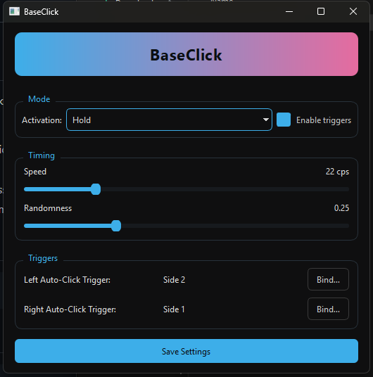

<div align="center">
	
	<br>
	<b style="font-size:1.18em; color:#3DAEE9; letter-spacing:0.5px;">A minimalist, modern auto clicker for Windows</b>
	<br>
	<a href="https://github.com/TudorMarchis/AutoClicker/releases/tag/v1.0.0"></a>
	<br><br>
</div>


## Features

✔️ Global triggers (side mouse buttons or any keyboard key)<br>
✔️ Left & right auto-clickers<br>
✔️ Hold or toggle activation<br>
✔️ Adjustable CPS (clicks/sec) & randomness (jitter)<br>
✔️ Minimal CPU usage, runs in background<br>
✔️ Slick, dark, accent-driven UI<br>
✔️ Easy config, portable, no admin required

---

## Quick Start

1. <b>Install dependencies</b>:
	 ```bash
	 pip install -r requirements.txt
	 ```
2. <b>Run BaseClick</b>:
	 ```bash
	 python main.py
	 ```
3. <b>Bind triggers</b> (side mouse or keyboard), set your speed & go!

Settings are saved to <code>%APPDATA%/BaseClick/config.json</code> on Windows.

---

## Download

Get the latest release as a ready-to-run EXE:

👉 <a href="https://github.com/TudorMarchis/AutoClicker/releases/tag/v1.0.0"><b>Download BaseClick v1.0.0</b></a>

---

## Screenshot

<div align="center">
	
</div>
